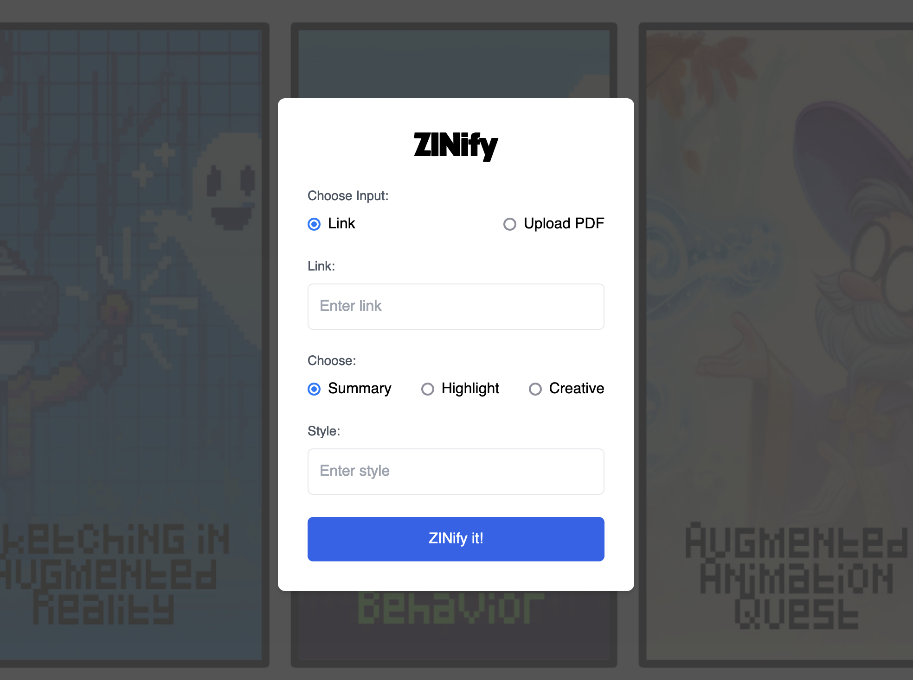

# **ZINify:** Transforming Research Papers into Engaging Zines with Large Language Models

### 🏅 Honorable Mention (People's Choice) - UIST '23

**Abstract**: 

Research papers are a vital building block for scientific discussion. While these papers follow effective structures for the relevant community, they are unable to cater to novice readers and express otherwise creative ideas in creative mediums. To this end, we propose ZINify, the first approach to automatically transform research papers into engaging zines using large language models (LLM) and text-to-image generators. Following zine’s long history of supporting independent, creative expression, we propose a technique that can work with authors to build more engaging, marketable, and unconventional content that is based on their research. We believe that our work will help make research more engaging and accessible to all while helping papers stand out in crowded online venues.



# Run ZINify

Create a python environment (tested with Python 3.9) and install all requirements:

```bash
cd src/
pip install -r requirements.txt
```

Set your Claude-2 API key in the file `src/backend/llm_api_wrappers/APIKEYS.py`.

Now, you can start the application with:

```bash
python flask_app.py
```

and navigate to `http://localhost:6006/` in your browser. Once you run the application, you will see a preview of the zine generation process. The final outputs can be seen in the `outputs/` folder.

# Acknowledgements

We thank Anthropic for providing API access to Claude-2 which we used for this project.